## Commit Monitor (with auto-push)

This repository is a small demo that shows a simple frontend showing commit history and a background "committer" process that appends timestamped commits to `data/commits.json`, commits them locally, and attempts to push to a Git remote.

The project is intentionally minimal so it can be used as a Jenkins/Docker demo: the build validates tests, the image can serve the static UI, and the `updater.js` process demonstrates an automated producer that modifies repo state.

**Key pieces**
- `server.js`: simple static HTTP server used for local integration and e2e tests.
- `index.html` + `app.js` + `style.css`: front-end that polls `data/commits.json` and renders recent commits.
- `updater.js`: the committer/updater process — creates a commit entry, runs `git add/commit`, and pushes.
- `scripts/health-check.js`: simple health-check script used by tests and CI.
- `tests/`: unit, integration, and e2e tests run by `npm test`.

How the UI updates
- The browser polls `data/commits.json` every 5 seconds (`app.js`), fetches the full file, and appends any new commits to the UI. The updater writes one commit per second by default, so the UI will display new commits on the next poll — there is no batching of 5 commits.

Quick start (local)
1. Install Node (the project runs on Node; Python is not required).
2. Start the app server (recommended):

```bash
# start the Node static server on port 3000
npm run start
# or explicitly
node server.js
```

3. Open the UI at `http://localhost:3000/`.

4. Run the committer (it will create commits and attempt to push):

```bash
npm run committer
# or
node updater.js
```

NPM scripts
- `npm run start` — starts `server.js`.
- `npm run committer` — starts `updater.js` (creates and pushes commits).
- `npm run test` — runs unit, integration, and e2e tests.
- `npm run health-check` — runs the health-check script.

Docker & CI notes
- The repository's `Dockerfile` runs `npm test` at build time so Jenkins/Docker builds fail fast if tests fail. Because of that, tests must be present in the Docker build context (they should not be excluded by `.dockerignore`).
- If you prefer not to include tests in the final image, consider converting the `Dockerfile` to a multi-stage build that runs tests in an intermediate stage and copies only runtime files into the final image.

Common Docker build issues
- If you see `Could not find '/app/tests/unit/*.js'` during `docker build`, check `.dockerignore` — remove `tests/` so test files are copied into the build context, or use a multi-stage build.
- The e2e tests expect the app server to be reachable; `scripts/health-check.js` defaults to `http://127.0.0.1:3000/` (or `PORT` env) which matches the in-test server used by `tests/e2e/health.test.js`.

Testing and CI
- `npm test` runs:
  - unit tests: `node --test tests/unit/*.js`
  - integration tests: `node --test tests/integration/*.js`
  - e2e tests: `node --test tests/e2e/*.js` (these start a local `node server.js` and run `scripts/health-check.js`).
- Jenkins pipeline in this project checks out the repo, installs deps, runs lint/tests, builds the app, and performs a Docker build. If the Docker build runs tests at build-time, make sure tests are available in the build context.

Configuration & Security
- `updater.js` currently sets a default remote URL and attempts to push. Do not run the committer on important branches without reviewing the code and configuring a safe remote or working branch.
- Recommended: configure the remote and credentials outside the repo (SSH keys, credential helpers, or environment variables). Avoid embedding secrets in code.

Contributing
- Run `npm test` locally before creating a PR.
- If you change test behavior or ports, update `scripts/health-check.js` and the e2e tests accordingly.

If you'd like, I can:
- Switch `updater.js` to read its remote from an environment variable or default to SSH.
- Convert the `Dockerfile` to a multi-stage build so tests run but are not copied into the final runtime image.
- Add a `Makefile` or `dev` script to simplify common dev tasks.

License: MIT

---
Updated to include usage, CI notes, and Docker tips.

**CI / Jenkins Workflow Diagram**

```mermaid
flowchart LR
  A[Checkout] --> B[Install deps]
  B --> C[Test & Lint]
  C --> D[Build artifact]
  D --> E[Docker build & image]
  E --> F[Push to registry]
  F --> G[Deploy to staging]
  G --> H[Smoke tests]
  H --> I{Smoke OK?}
  I -- No --> X[Rollback & notify]
  I -- Yes --> J[Manual approval]
  J --> K[Deploy to production]
  K --> L[Post-deploy health check]
  L --> M[Notify success]
  X --> M[Notify failure]

  %% Higher-contrast, accessible colors
  style A fill:#0b69ff,stroke:#003366,color:#ffffff
  style B fill:#0b69ff,stroke:#003366,color:#ffffff
  style C fill:#ffb703,stroke:#b36b00,color:#000000
  style D fill:#2d6a4f,stroke:#1b4332,color:#ffffff
  style E fill:#2d6a4f,stroke:#1b4332,color:#ffffff
  style F fill:#264653,stroke:#0b3a3a,color:#ffffff
  style G fill:#ffffff,stroke:#6c757d,color:#000000
  style H fill:#ffffff,stroke:#6c757d,color:#000000
  style K fill:#085f63,stroke:#063a3b,color:#ffffff
  style L fill:#ffffff,stroke:#6c757d,color:#000000
  style M fill:#198754,stroke:#0f5132,color:#ffffff
  style X fill:#dc3545,stroke:#a71d2a,color:#ffffff

  classDef small font-size:12px;
```



This diagram matches the pipeline stages used by the included Jenkinsfile: checkout, install, lint/tests (parallel), build, docker build, security scan, push, deploy, smoke tests, approval, deploy, and final health check.
